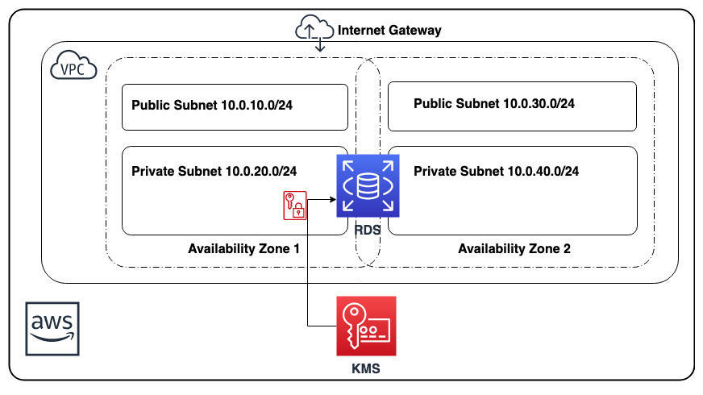

# aws-encrypted-rds-cf-template

## Description:

This <a href="https://aws.amazon.com/cloudformation/" target="_blank">AWS CloudFormation</a> solution creates an AES-256 encrypted <a href="https://aws.amazon.com/rds" target="_blank"> AWS RDS</a> MySQL database in a <a href="https://aws.amazon.com/vpc" target="_blank"> AWS VPC</a> with 2 public subnets and 2 private subnets leveraging two availbility zones. The encryption key is managed via <a href="https://aws.amazon.com/kms" target="_blank"> AWS KMS</a>. Once your data is encrypted, Amazon RDS handles authentication of access and decryption of your data transparently with a minimal impact on performance. You don't need to modify your database client applications to use encryption at rest.

AWS CloudFormation provides a common language for you to describe and provision all the infrastructure resources in your cloud environment.

Amazon Virtual Private Cloud (Amazon VPC) lets you provision a logically isolated section of the AWS Cloud where you can launch AWS resources in a virtual network that you define.

Amazon Relational Database Service (Amazon RDS) makes it easy to set up, operate, and scale a relational database in the cloud.

AWS Key Management Service (KMS) makes it easy for you to create and manage keys and control the use of encryption across a wide range of AWS services and in your applications. AWS KMS is a secure and resilient service that uses FIPS 140-2 validated hardware security modules to protect your keys.

## AWS Resource Costs

As with most AWS services you will incur costs for usage. For this CloudFormation template the resources that incur costs are as follows.

* Pricing:

   * <a href="https://aws.amazon.com/rds/mysql/pricing/" target="_blank">RDS pricing</a> resource used in example: *db.t2.small*
   * <a href="https://aws.amazon.com/kms/pricing/" target="_blank">KMS pricing</a> resource used in example: *1 KMS key*

## Prerequisites

* <a href="https://aws.amazon.com" target="_blank"> Amazon Web Services Account</a>
* Use Oregon (us-west-2) for the this example
* <a href="https://aws.amazon.com/iam/" target="_blank">IAM</a> user with the following permissions:
   * AWSCloudFormationReadOnlyAccess
   * AWSKeyManagementServicePowerUser
   * AmazonVPCFullAccess
   * AmazonEC2FullAccess
   * AmazonRDSFullAccess

## CloudFormation Template

* The CloudFormation Template is available on GitHub:
   * <a href="https://github.com/getcft/aws-encrypted-rds-cf-template" target="_blank">aws-encrypted-rds-cf-template</a>

## Deploy the CloudFormation Template

* AWS Management Console

   * Login to *AWS Management Console* (use the Oregon region)
   * Launch under *CloudFormation* your *encrypted-rds-cf-template.yml* (included in this repo)

* CloudFormation Fields:

   * *Stack name* (Enter a name to associate to your AWS RDS deployment)
   * Continue choosing *Next*
   * Click *Create* (This will take a few minutes for resources to be created)

## Results of the CloudFormation Template

In the *AWS Management Console* you should be able to verify the following have been created.

* Resources Created:
   * 1 Public Subnet 10.0.10.0/24 (in Zone A, with 254 usable IP's)
   * 1 Private Subnet 10.0.20.0/24 (in Zone A, with 254 usable IP's)
   * 1 Public Subnet 10.0.30.0/24 (in Zone B, with 254 usable IP's)
   * 1 Private Subnet 10.0.40.0/24 (in Zone B, with 254 usable IP's)
   * 5 Route table entries to route traffic either within 10.0.0.0/16 or to the Internet Gateway for outbound
   * 1 Internet Gateway (for public zone outbound traffic)
   * 1 RDS Subnet Group (private zone a and b)
   * 1 KMS CMK for encryption
   * 1 RDS Security EC2 Group (allowing access within 10.0.0.0/16 for MySQL port 3306)
   * 1 RDS db.t2.small MySQL instance
   * 1 DB master user "dbuser" you can connect without a password
   mysql -h *endpointhostname* -P 3306 -u dbuser -p from within 10.0.0.0/16
